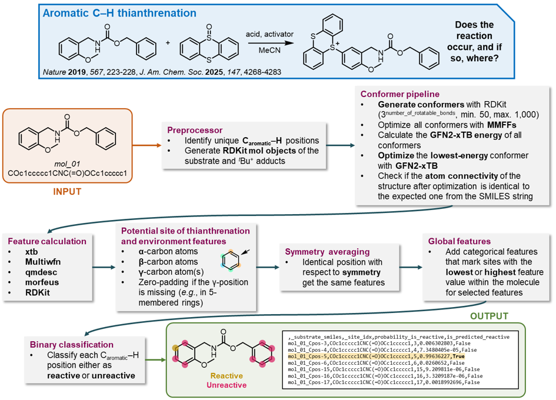

# Predictive model for the Aromatic ThianThrenation reaction for C-H functionalization (PATTCH) 
```PATTCH``` is a hybrid SQM/ML workflow for the prediction of the reaction feasibility and site-selectivity of the direct thianthrenation reaction of aromatic C-H bonds.  
For further information, please refer to our [preprint](https://chemrxiv.org/engage/chemrxiv/article-details/6823546950018ac7c5f0504d) and publication (under review).  



## Installation  
### 1) Installation of PATTCH
Clone the repository. 
```shell
git clone https://github.com/MolecularAI/thianthrenation_prediction.git
```
Create a conda environment with the provided ```pattch_env.yaml``` file and install the ```pattch``` package into the environment. 
```shell
conda env create -f pattch_env.yml -n pattch_env
conda activate pattch_env
pip install .
```
After the installation, change line 34 in ```handler.py``` of the ```qmdesc``` dependency to make it compatible with Pytorch 2.  
From 
```python
        state = torch.load(stream, lambda storage, loc: storage)
```
to 
```python
        state = torch.load(stream, lambda storage, loc: storage, weights_only=False)
```
### 2) Installation of Multiwfn
The PATTCH workflow requires the noGUI version of [Multiwfn](https://doi.org/10.1063/5.0216272) as a mandatory dependency. Go through the following steps to install the program (if not already installed). Additional information on the installation can be found in section 2.1 of the [Multiwfn manual](http://sobereva.com/multiwfn/download.html).  
a) Dowload the ```Multiwfn_3.8_dev_bin_Linux_noGUI.zip``` file from this [webpage](http://sobereva.com/multiwfn/download.html).  
b) Unzip the folder and place it in an appropriate directory which can be accessed by PATTCH.  
c) Ensure that the downloaded ```Multiwfn_noGUI``` file has executable permission. If not, this can be added by changing the current working directory to where Multiwfn was saved followed by executing the following command.
```shell
chmod +x Multiwfn_noGUI
```
d) Add the following lines to your ```.bashrc``` file. Replace ```<path to parent directory>``` with the correct path. This will make Multiwfn available to the command line, regardless of the current working directory.  
```bash
export Multiwfnpath=<path to parent directory>/Multiwfn_3.8_dev_bin_Linux_noGUI
export PATH=$PATH:<path to parent directory>/Multiwfn_3.8_dev_bin_Linux_noGUI
```
e) Open a new terminal and run the program (for testing without any input file) by executing the following command. 
```shell
Multiwfn_noGUI
```
This should result in output printed to the terminal containing the following text.  
```
Multiwfn -- A Multifunctional Wavefunction Analyzer
Version 3.8(dev), release date: 2023-Oct-8
Developer: Tian Lu (Beijing Kein Research Center for Natural Sciences)
Below paper ***MUST BE CITED*** if Multiwfn is utilized in your work:
         Tian Lu, Feiwu Chen, J. Comput. Chem., 33, 580-592 (2012)
```

## Usage 
Set environment variables before running the model by executing the following commands in the shell. 
```shell
export OMP_STACKSIZE=3G
export OMP_NUM_THREADS=1
export OMP_MAX_ACTIVE_LEVELS=1
export MKL_NUM_THREADS=1
```
After activating the environment, the ```pattch``` package can be used as follows by simply specifying the input ```*.csv``` file (```-i```). The input file must at least contain two columns labeled *substrate_name* (identification string for each compound) and *substrate_smiles* (SMILES string of each compound). For testing, you can run the fullowing commands.  
```shell
cd examples/sample_run
python -m pattch -i sample_input.csv
```
The exact run type of the PATTCH workflow can be configured through the ```-i```, ```-p```, ```-a``` and ```-x``` flags. Run the following command to see their functionality.  
```shell
python -m pattch --help
```
The prediction results can be found in the ```prediction_results``` folder. Output files generated along the prediction pipeline are saved to the ```output_files``` folder. 
